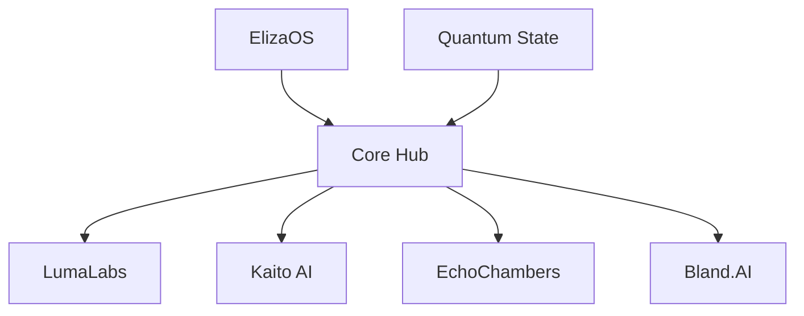

# Core Modules Overview

## System Components

Project X consists of several core modules that work together to create a seamless, immersive experience.

### 1. ElizaOS
The central persona engine that manages character personalities and interactions.
[Learn more about ElizaOS](./elizaos.md)

### 2. LumaLabs
Automated video generation system for visual content creation.
[Learn more about LumaLabs](./lumalabs.md)

### 3. Kaito AI Analytics
Real-time analysis engine for market movements and social signals.
[Learn more about Kaito AI](./kaito-ai.md)

### 4. EchoChambers
Autonomous Twitter Spaces management and engagement system.
[Learn more about EchoChambers](./echochambers.md)

### 5. Bland.AI Integration
Voice synthesis and phone call management system.
[Learn more about Bland.AI Integration](./bland-ai.md)

## Module Architecture



## Integration Points

Each module provides specific integration points:

```typescript
interface ModuleIntegration {
  initialize(): Promise<void>;
  connect(): Promise<void>;
  handleEvents(events: Event[]): void;
  cleanup(): Promise<void>;
}
```

## Best Practices

1. **Module Independence**
   - Keep modules loosely coupled
   - Use event-driven communication
   - Implement proper error handling

2. **State Management**
   - Maintain consistent state
   - Handle race conditions
   - Implement proper cleanup

3. **Performance**
   - Monitor resource usage
   - Implement caching
   - Handle rate limits

4. **Security**
   - Validate inputs
   - Encrypt sensitive data
   - Monitor access patterns

## Module Configuration

Example configuration for all modules:

```yaml
elizaos:
  personality_switching: true
  context_awareness: true

lumalabs:
  video_quality: high
  max_duration: 15

kaito:
  analysis_interval: 60
  alert_threshold: 0.8

echochambers:
  auto_schedule: true
  engagement_threshold: 0.7

bland_ai:
  voice_quality: high
  call_timeout: 300
  model: neural
```

## Error Handling

Implement proper error handling for each module:

```typescript
try {
  await module.initialize();
} catch (error) {
  if (error instanceof ModuleError) {
    // Handle module-specific error
  } else {
    // Handle general error
  }
}
```

## Next Steps

1. [Set up ElizaOS](./elizaos.md)
2. [Configure LumaLabs](./lumalabs.md)
3. [Initialize Kaito AI](./kaito-ai.md)
4. [Set up EchoChambers](./echochambers.md)
5. [Configure Twilio](./twilio.md)