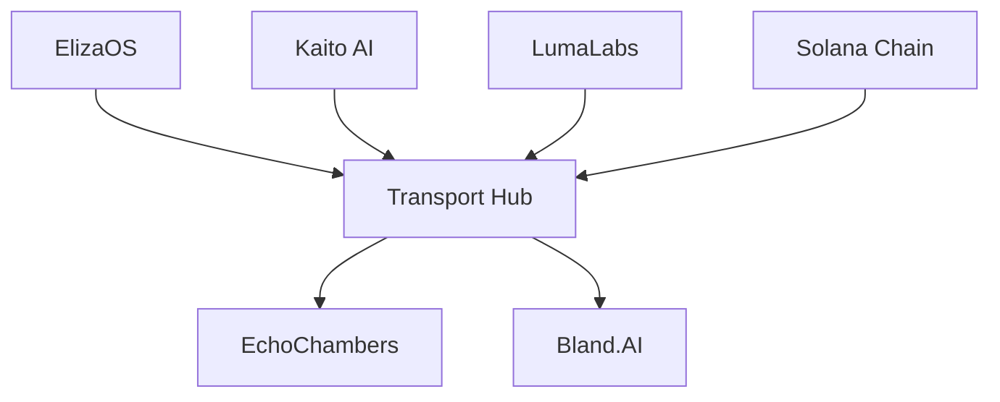

# Architecture Overview

## High-Level System Design

Project X orchestrates five key modules working in harmony to deliver a unique crypto-cultural experience:

### 1. Core Components

Project X orchestrates five key modules working in harmony to deliver a unique crypto-cultural experience:

#### ElizaOS
- Conspiratorial persona engine
- Internal logic for autonomous actions
- Self-initiates calls, videos, and on-chain data storage

#### LumaLabs
- Automated short-video generator
- Responds to ElizaOS actions
- Posts 6-second clips directly to Twitter

#### Kaito AI Analytics
- Real-time analysis engine
- Monitors hashtags and influencer commentary
- Feeds fresh data to ElizaOS

#### EchoChambers
- Self-scheduling Twitter Spaces framework
- Autonomous hosting capabilities
- Real-time engagement monitoring

#### Twilio Integration
- Phone-calling interface
- Delivers "Illuminati updates"
- Handles subscriber management

### 2. Multi-Agent Orchestration

The system employs a sophisticated multi-agent architecture:

- **Transport Hub (Project-X)**
  - Central gateway for data collection
  - Maintains consistent information flow
  - Coordinates agent responses

- **Plugin & Inference Layer**
  - Dynamic plugin loading
  - Context-aware agent selection
  - Advanced function support

- **Swarm-Based Collaboration**
  - Multiple agents working in tandem
  - Pooled skill sets and data streams
  - "Hive-mind" approach

### 3. Solana Integration

The Solana AI Agent Toolkit provides:

- Auditable on-chain logging
- Trustless triggers
- Event-driven task execution
- Token launching capabilities

## Data Flow

## System Requirements

- Node.js 18+
- Solana CLI tools
- API keys for:
  - Twilio
  - LumaLabs
  - Kaito AI
  - GMGN.ai

## Security Architecture

- End-to-end encryption for calls
- Secure key management
- Rate limiting
- DDoS protection
- Audit logging